# BIỂU ĐỒ LỚP BCE - HỆ THỐNG NHH-COFFEE

## CODE PLANTUML - LAYOUT GIỐNG ẢNH

Copy toàn bộ code dưới đây vào PlantUML: https://www.plantuml.com/plantuml/uml/

```plantuml
@startuml BCE_NHH_COFFEE

' Cấu hình layout ngang giống ảnh
left to right direction
skinparam linetype ortho
skinparam nodesep 60
skinparam ranksep 80

' Màu sắc
!define BOUNDARY_COLOR #D5E8D4
!define CONTROL_COLOR #FFE6CC
!define ENTITY_COLOR #DAE8FC

' ========== ACTORS (Bên trái) ==========
actor "Khách\nhàng" as Customer
actor "Nhân\nviên" as Staff
actor "Quản\nlý" as Manager
actor "Admin" as Admin

' ========== MODULE SẢN PHẨM ==========
rectangle "ProductPage\n<<boundary>>" as B_ProductPage BOUNDARY_COLOR
rectangle "ProductAPI\n<<boundary>>" as B_ProductAPI BOUNDARY_COLOR

rectangle "ProductController\n<<control>>\n---\n+getProducts()\n+createProduct()\n+updateProduct()\n+deleteProduct()" as C_ProductCtrl CONTROL_COLOR

rectangle "ProductService\n<<control>>\n---\n+validateProductData()\n+calculateDiscount()\n+checkStock()" as C_ProductSvc CONTROL_COLOR

rectangle "Product\n<<entity>>\n---\n+id: UUID\n+name: String\n+price: Decimal\n+stock: Integer" as E_Product ENTITY_COLOR

rectangle "Category\n<<entity>>\n---\n+id: UUID\n+name: String\n+slug: String" as E_Category ENTITY_COLOR

Customer --> B_ProductPage
Staff --> B_ProductAPI
B_ProductPage --> C_ProductCtrl
B_ProductAPI --> C_ProductCtrl
C_ProductCtrl --> C_ProductSvc
C_ProductSvc --> E_Product
E_Product --> E_Category

' ========== MODULE ĐỚN HÀNG ==========
rectangle "CheckoutPage\n<<boundary>>" as B_CheckoutPage BOUNDARY_COLOR
rectangle "OrderAPI\n<<boundary>>" as B_OrderAPI BOUNDARY_COLOR

rectangle "OrderController\n<<control>>\n---\n+createOrder()\n+getOrderById()\n+updateStatus()" as C_OrderCtrl CONTROL_COLOR

rectangle "OrderService\n<<control>>\n---\n+validateOrder()\n+calculateTotal()\n+processPayment()" as C_OrderSvc CONTROL_COLOR

rectangle "PaymentService\n<<control>>\n---\n+generateQRCode()\n+verifyPayment()" as C_PaymentSvc CONTROL_COLOR

rectangle "Order\n<<entity>>\n---\n+id: UUID\n+orderNumber\n+status\n+total: Decimal" as E_Order ENTITY_COLOR

rectangle "OrderItem\n<<entity>>\n---\n+id: UUID\n+orderId\n+quantity: Int" as E_OrderItem ENTITY_COLOR

Customer --> B_CheckoutPage
Staff --> B_OrderAPI
B_CheckoutPage --> C_OrderCtrl
B_OrderAPI --> C_OrderCtrl
C_OrderCtrl --> C_OrderSvc
C_OrderCtrl --> C_PaymentSvc
C_OrderSvc --> E_Order
E_Order --> E_OrderItem

' ========== MODULE XÁC THỰC ==========
rectangle "LoginPage\n<<boundary>>" as B_LoginPage BOUNDARY_COLOR
rectangle "RegisterPage\n<<boundary>>" as B_RegisterPage BOUNDARY_COLOR
rectangle "AuthAPI\n<<boundary>>" as B_AuthAPI BOUNDARY_COLOR

rectangle "AuthController\n<<control>>\n---\n+register()\n+verifyOTP()\n+login()\n+logout()" as C_AuthCtrl CONTROL_COLOR

rectangle "AuthService\n<<control>>\n---\n+validateUser()\n+hashPassword()\n+generateJWT()" as C_AuthSvc CONTROL_COLOR

rectangle "UserService\n<<control>>\n---\n+getUserById()\n+updateProfile()\n+updatePoints()" as C_UserSvc CONTROL_COLOR

rectangle "User\n<<entity>>\n---\n+id: UUID\n+email: String\n+name: String\n+role: UserRole" as E_User ENTITY_COLOR

rectangle "PendingReg\n<<entity>>\n---\n+id: UUID\n+email: String\n+otp: String" as E_PendingReg ENTITY_COLOR

Customer --> B_LoginPage
Customer --> B_RegisterPage
Admin --> B_AuthAPI
B_LoginPage --> C_AuthCtrl
B_RegisterPage --> C_AuthCtrl
B_AuthAPI --> C_AuthCtrl
C_AuthCtrl --> C_AuthSvc
C_AuthCtrl --> C_UserSvc
C_AuthSvc --> E_User
C_AuthSvc --> E_PendingReg

' ========== MODULE GIỎ HÀNG ==========
rectangle "CartPage\n<<boundary>>" as B_CartPage BOUNDARY_COLOR
rectangle "CartAPI\n<<boundary>>" as B_CartAPI BOUNDARY_COLOR

rectangle "CartController\n<<control>>\n---\n+getCart()\n+addToCart()\n+updateItem()" as C_CartCtrl CONTROL_COLOR

rectangle "CartService\n<<control>>\n---\n+validateCart()\n+calculateTotal()" as C_CartSvc CONTROL_COLOR

rectangle "CartItem\n<<entity>>\n---\n+id: UUID\n+userId\n+productId\n+quantity: Int" as E_CartItem ENTITY_COLOR

Customer --> B_CartPage
B_CartPage --> C_CartCtrl
B_CartAPI --> C_CartCtrl
C_CartCtrl --> C_CartSvc
C_CartSvc --> E_CartItem
E_CartItem --> E_Product

' ========== MODULE CHATBOT ==========
rectangle "ChatWidget\n<<boundary>>" as B_ChatWidget BOUNDARY_COLOR
rectangle "ChatAPI\n<<boundary>>" as B_ChatAPI BOUNDARY_COLOR

rectangle "ChatController\n<<control>>\n---\n+sendMessage()\n+getSessions()\n+closeSession()" as C_ChatCtrl CONTROL_COLOR

rectangle "ChatbotService\n<<control>>\n---\n+processMessage()\n+detectIntent()\n+callGeminiAPI()" as C_ChatbotSvc CONTROL_COLOR

rectangle "SocketService\n<<control>>\n---\n+emitMessage()\n+broadcastToStaff()" as C_SocketSvc CONTROL_COLOR

rectangle "ChatSession\n<<entity>>\n---\n+id: UUID\n+userId\n+status" as E_ChatSession ENTITY_COLOR

rectangle "ChatMessage\n<<entity>>\n---\n+id: UUID\n+message\n+isAI: Bool" as E_ChatMessage ENTITY_COLOR

rectangle "ChatKnowledge\n<<entity>>\n---\n+id: UUID\n+question\n+answer" as E_ChatKnowledge ENTITY_COLOR

Customer --> B_ChatWidget
Staff --> B_ChatAPI
B_ChatWidget --> C_ChatCtrl
B_ChatAPI --> C_ChatCtrl
C_ChatCtrl --> C_ChatbotSvc
C_ChatCtrl --> C_SocketSvc
C_ChatbotSvc --> E_ChatSession
C_ChatbotSvc --> E_ChatMessage
C_ChatbotSvc --> E_ChatKnowledge
E_ChatSession --> E_ChatMessage

' ========== MODULE KHO ==========
rectangle "StockPage\n<<boundary>>" as B_StockPage BOUNDARY_COLOR
rectangle "StockAPI\n<<boundary>>" as B_StockAPI BOUNDARY_COLOR

rectangle "StockController\n<<control>>\n---\n+getInventory()\n+importStock()\n+adjustStock()" as C_StockCtrl CONTROL_COLOR

rectangle "StockService\n<<control>>\n---\n+validateStock()\n+updateStock()\n+checkLowStock()" as C_StockSvc CONTROL_COLOR

rectangle "StockTransaction\n<<entity>>\n---\n+id: UUID\n+productId\n+type\n+quantity: Int" as E_StockTxn ENTITY_COLOR

Staff --> B_StockPage
Manager --> B_StockAPI
B_StockPage --> C_StockCtrl
B_StockAPI --> C_StockCtrl
C_StockCtrl --> C_StockSvc
C_StockSvc --> E_StockTxn
E_StockTxn --> E_Product

' ========== MODULE ĐÁNH GIÁ ==========
rectangle "ReviewPage\n<<boundary>>" as B_ReviewPage BOUNDARY_COLOR
rectangle "ReviewAPI\n<<boundary>>" as B_ReviewAPI BOUNDARY_COLOR

rectangle "ReviewController\n<<control>>\n---\n+createReview()\n+getReviews()\n+moderate()" as C_ReviewCtrl CONTROL_COLOR

rectangle "ReviewService\n<<control>>\n---\n+validateReview()\n+calculateRating()\n+uploadImages()" as C_ReviewSvc CONTROL_COLOR

rectangle "Review\n<<entity>>\n---\n+id: UUID\n+productId\n+rating: Int\n+comment" as E_Review ENTITY_COLOR

Customer --> B_ReviewPage
Staff --> B_ReviewAPI
B_ReviewPage --> C_ReviewCtrl
B_ReviewAPI --> C_ReviewCtrl
C_ReviewCtrl --> C_ReviewSvc
C_ReviewSvc --> E_Review
E_Review --> E_Product
E_Review --> E_User

' ========== MODULE KHUYẾN MÃI ==========
rectangle "PromotionPage\n<<boundary>>" as B_PromotionPage BOUNDARY_COLOR
rectangle "PromotionAPI\n<<boundary>>" as B_PromotionAPI BOUNDARY_COLOR

rectangle "PromotionCtrl\n<<control>>\n---\n+createPromotion()\n+applyPromotion()\n+validateCode()" as C_PromotionCtrl CONTROL_COLOR

rectangle "PromotionService\n<<control>>\n---\n+checkEligibility()\n+calculateDiscount()\n+trackUsage()" as C_PromotionSvc CONTROL_COLOR

rectangle "Promotion\n<<entity>>\n---\n+id: UUID\n+code: String\n+discountValue\n+isActive" as E_Promotion ENTITY_COLOR

rectangle "PromotionUsage\n<<entity>>\n---\n+id: UUID\n+promotionId\n+orderId" as E_PromotionUsage ENTITY_COLOR

Staff --> B_PromotionPage
B_PromotionPage --> C_PromotionCtrl
B_PromotionAPI --> C_PromotionCtrl
C_PromotionCtrl --> C_PromotionSvc
C_PromotionSvc --> E_Promotion
C_PromotionSvc --> E_PromotionUsage
E_PromotionUsage --> E_Promotion

' ========== MODULE BÁO CÁO ==========
rectangle "ReportPage\n<<boundary>>" as B_ReportPage BOUNDARY_COLOR
rectangle "ReportAPI\n<<boundary>>" as B_ReportAPI BOUNDARY_COLOR

rectangle "ReportController\n<<control>>\n---\n+getRevenueReport()\n+getOrderReport()\n+exportReport()" as C_ReportCtrl CONTROL_COLOR

rectangle "ReportService\n<<control>>\n---\n+aggregateData()\n+generateCharts()\n+exportPDF()" as C_ReportSvc CONTROL_COLOR

Manager --> B_ReportPage
Admin --> B_ReportAPI
B_ReportPage --> C_ReportCtrl
B_ReportAPI --> C_ReportCtrl
C_ReportCtrl --> C_ReportSvc
C_ReportSvc --> E_Order
C_ReportSvc --> E_Product
C_ReportSvc --> E_User

@enduml
```

## HƯỚNG DẪN SỬ DỤNG

### Bước 1: Truy cập PlantUML Online
Mở trình duyệt và vào: **https://www.plantuml.com/plantuml/uml/**

### Bước 2: Copy code
- Chọn toàn bộ code từ `@startuml` đến `@enduml` ở trên
- Copy (Ctrl+C)

### Bước 3: Paste vào PlantUML
- Xóa hết code mẫu trong editor
- Paste code vừa copy (Ctrl+V)
- Click nút **"Submit"**

### Bước 4: Download ảnh
- Đợi vài giây để render
- Click **"PNG"** để download ảnh PNG
- Hoặc click **"SVG"** để download vector (chất lượng cao hơn)

## ĐẶC ĐIỂM

✅ **Layout ngang** (left to right) - giống hệt ảnh bạn gửi
✅ **Actor bên trái** - Khách hàng, Nhân viên, Quản lý, Admin
✅ **Boundary → Control → Entity** - sắp xếp từ trái sang phải
✅ **Màu sắc rõ ràng**:
   - Boundary (xanh lá): #D5E8D4
   - Control (cam): #FFE6CC
   - Entity (xanh dương): #DAE8FC
✅ **Đầy đủ 9 modules** của hệ thống NHH-Coffee
✅ **Mũi tên kết nối** thể hiện luồng dữ liệu

## CÁC MODULE

| Module | Boundary | Control | Entity |
|--------|----------|---------|--------|
| 1. Sản phẩm | ProductPage, ProductAPI | ProductController, ProductService | Product, Category |
| 2. Đơn hàng | CheckoutPage, OrderAPI | OrderController, OrderService, PaymentService | Order, OrderItem |
| 3. Xác thực | LoginPage, RegisterPage, AuthAPI | AuthController, AuthService, UserService | User, PendingReg |
| 4. Giỏ hàng | CartPage, CartAPI | CartController, CartService | CartItem |
| 5. Chatbot | ChatWidget, ChatAPI | ChatController, ChatbotService, SocketService | ChatSession, ChatMessage, ChatKnowledge |
| 6. Kho | StockPage, StockAPI | StockController, StockService | StockTransaction |
| 7. Đánh giá | ReviewPage, ReviewAPI | ReviewController, ReviewService | Review |
| 8. Khuyến mãi | PromotionPage, PromotionAPI | PromotionController, PromotionService | Promotion, PromotionUsage |
| 9. Báo cáo | ReportPage, ReportAPI | ReportController, ReportService | (Sử dụng Order, Product, User) |

## LƯU Ý

- Biểu đồ sẽ tự động layout theo chiều ngang
- Nếu quá lớn, có thể zoom in/out trong file PNG/SVG
- Để chỉnh khoảng cách, thay đổi `nodesep` và `ranksep`
- File SVG có chất lượng tốt hơn để in ấn hoặc đưa vào báo cáo

